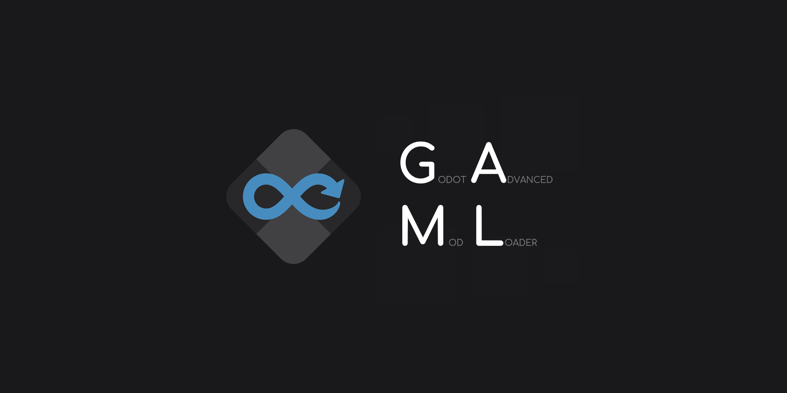

# Godot Advanced Mod Loader
>[!WARNING]
>This tool is still deep in development and breaking changes will come with every new version. For simpler mods that only involve skinning/asset replacement, consider [GUMM](https://github.com/KoBeWi/Godot-Universal-Mod-Manager).

**GAML** takes advantage of Godot's built-in features to inject itself and other mods into any[^1] Godot game.
[^1]: Not all builds of the engine are confirmed to be working, and only 3.5 is currently officially supported.

## Attribution

Thank you [pyrule](https://github.com/Gapva) for the logo and social preview ❤️

## To Do
- [x] Support vanilla Godot 3.x
- [ ] Support vanilla Godot 4.x
- [x] Installation flow
	- [x] Create required files
	- [x] Generate configurations
		- [x] Replace autoloads
- [ ] Mod system
	- [ ] Mod info (id, name, etc.)
	- [x] Versioning system
	- [x] Logging
	- [ ] Dependencies
	- [ ] Export plugin
- [ ] Mod loading flow
	- [x] "Inject" mod loader (via bootstrapper)
	- [ ] Load & verify mods
		- [ ] GAML mods
		- [x] Asset mods
	- [ ] Initialise mods
	- [x] Load game
- [ ] Harmony-esque hooking
	- [ ] "Injection"/detours
	- [ ] Prefixes
	- [ ] Postfixes
	- [ ] Result replacement
- [ ] Mono support
