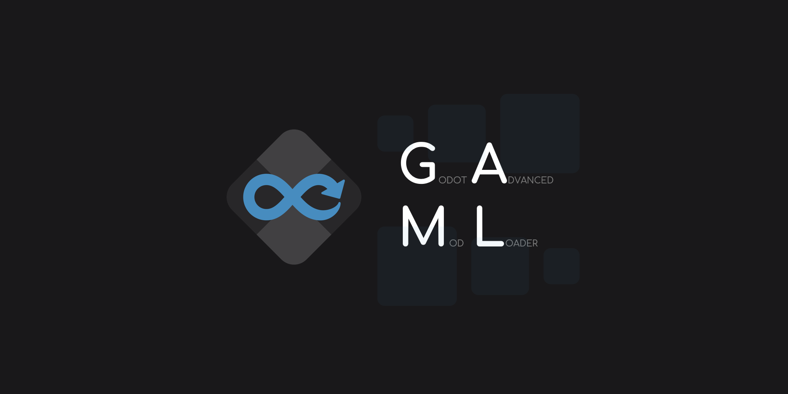

# Godot Advanced Mod Loader
>[!WARNING]
>Currently, GAML should work for Godot 3.1 and above. Support for 4.x will come soon and support for versions below 3.1 is not planned.

**GAML** takes advantage of Godot's built-in features to inject itself and other mods into any Godot game.

## Attribution

Thank you [pyrule](https://github.com/Gapva) for the logo and social preview ❤️
